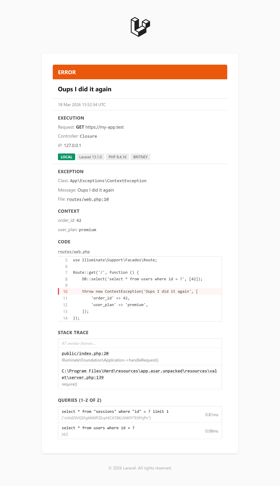

# Laravel Mail Log Channel


[](https://packagist.org/packages/shaffe/laravel-mail-log-channel) [](https://packagist.org/packages/shaffe/laravel-mail-log-channel)
[](https://opensource.org/licenses/MIT)

A service provider to add support for logging via email using Laravels built-in mail provider.

This package is a fork of [laravel-log-mailer](https://packagist.org/packages/designmynight/laravel-log-mailer) by Steve Porter.

## Features

- Structured error emails with clear sections
- Execution context: HTTP request (method, URL, route, controller, user), Artisan command, or Queue job (connection, queue)
- Environment badges: app environment, Laravel/PHP versions, server hostname
- Code snippet with error line highlighted
- Smart stack trace: application frames visible, vendor frames collapsed
- SQL queries with bindings and execution time
- Additional context from `Exception::context()` and log record
- Relative file paths for readability
- Previous exception chain display
- Clickable file paths to open directly in your editor (via `app.editor` config)

<details>
<summary>📸 See an example email</summary>



</details>

## Table of contents

* [Installation](#installation)
* [Configuration](#configuration)
* [SQL Query Logging](#sql-query-logging)
* [Editor Links](#editor-links)
* [Upgrading](#upgrading)

## Installation

You can install this package via composer using this commande:

```sh
composer require shaffe/laravel-mail-log-channel
```

### Laravel version compatibility

| Laravel                      | Package |
|:-----------------------------|:--------|
| 10, 11, 12, 13              | ^3.0    |
| 5.6, 6, 7, 8, 9, 10, 11, 12, 13 | ^2.0    |
| 5.6.x                        | ^1.0    |

The package will automatically register itself.

## Configuration

To ensure all unhandled exceptions are mailed:

1. create a `mail` logging channel in `config/logging.php`,
2. add this `mail` channel to your current logging stack,
3. add a `LOG_MAIL_ADDRESS` to your `.env` file to define the recipient.

You can specify multiple channels and individually change the recipients, the subject and the email template.

```php
'channels' => [
    'stack' => [
        'driver' => 'stack',
        // 2. Add mail to the stack:
        'channels' => ['single', 'mail'],
    ],

    // ...

    // 1. Create a mail logging channel:
    'mail' => [
        'driver' => 'mail',
        'level' => env('LOG_MAIL_LEVEL', 'notice'),

        // Specify mail recipient
        'to' => [
            [
                'address' => env('LOG_MAIL_ADDRESS'),
                'name' => 'Error',
            ],
        ],

        'from' => [
            // Defaults to config('mail.from.address')
            'address' => env('LOG_MAIL_ADDRESS'),
            // Defaults to config('mail.from.name')
            'name' => 'Errors'
        ],

        // Show all vendor frames in stack trace (collapsed by default)
        // 'collapse_vendor_frames' => true,

        // Disable SQL query collection in error emails
        // 'log_queries' => false,

        // Optionally overwrite the subject format pattern
        // Available placeholders: %level_name%, %message%, %env%, %context%, %app_name%, %channel%, %datetime%
        // 'subject_format' => '[%level_name%] [%env%] %context% — %message%',

        // Optionally overwrite the mailable template
        // Two variables are sent to the view: `string $content` and `array $records`
        // 'mailable' => NewLogMailable::class
    ],
],
```

### Recipients configuration format

The following `to` config formats are supported:

* single email address:

    ```php
    'to' => env('LOG_MAIL_ADDRESS', ''),
    ```

* array of email addresses:

     ```php
    'to' => explode(',', env('LOG_MAIL_ADDRESS', '')),
    ```

* associative array of email => name addresses:

    ```php
    'to' => [env('LOG_MAIL_ADDRESS', '') => 'Error'],`
    ```

* array of email and name:

    ```php
    'to' => [
         [
             'address' => env('LOG_MAIL_ADDRESS', ''),
             'name' => 'Error',
         ],
     ],
    ```

## SQL Query Logging

The last 10 SQL queries (with bindings and execution time) are automatically included in error emails.

To disable it:

```php
'mail' => [
    'driver' => 'mail',
    'log_queries' => false,
    // ...
],
```

## Editor Links

File paths in error emails are clickable if you have configured the `app.editor` option in your Laravel application. Clicking a link will open the file at the correct line in your editor.

Laravel supports this natively since v9. Set it in `config/app.php`:

```php
'editor' => 'phpstorm',
```

Or via environment variable:

```env
APP_EDITOR=phpstorm
```

Supported editors: `phpstorm`, `vscode`, `vscode-insiders`, `cursor`, `sublime`, `textmate`, `atom`, `nova`, `idea`.

You can also use a custom URL scheme:

```php
'editor' => [
    'href' => 'custom://open?file={file}&line={line}',
],
```

For remote servers where file paths differ from your local machine, use `base_path` to remap:

```php
'editor' => [
    'name' => 'phpstorm',
    'base_path' => '/local/path/to/project',
],
```

## Upgrading

### From v2 to v3

v3 completely redesigns the email output. The HTML format has changed and the `HtmlFormatter::addRow()` method has been removed.

v3 requires PHP 8.1+ and Laravel 10+. For older versions, use v2.

If you extended `HtmlFormatter` or relied on the HTML structure for parsing/filtering, review the new output format. The configuration API is unchanged — no config changes needed.
